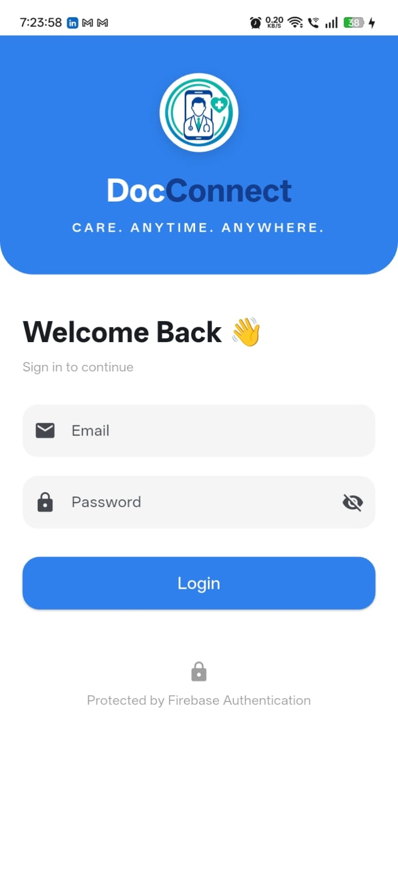
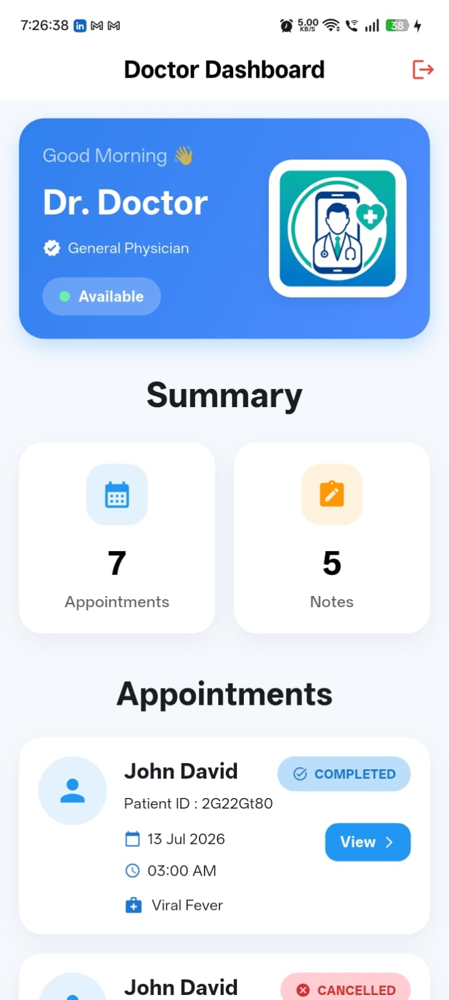
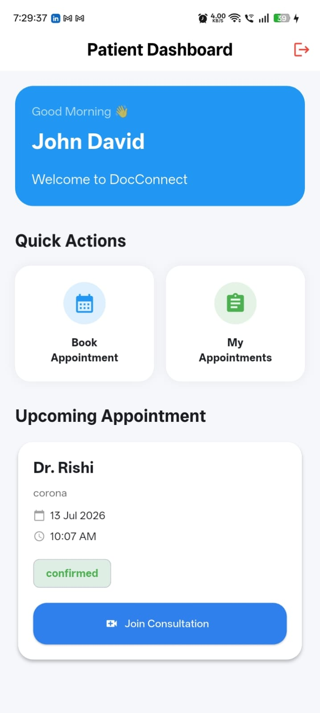
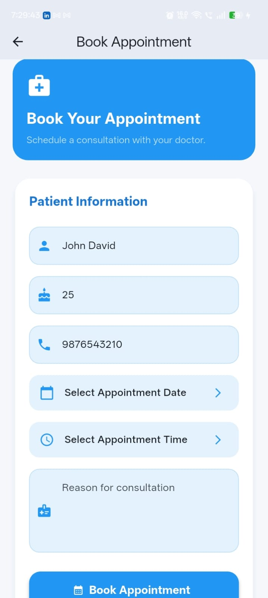
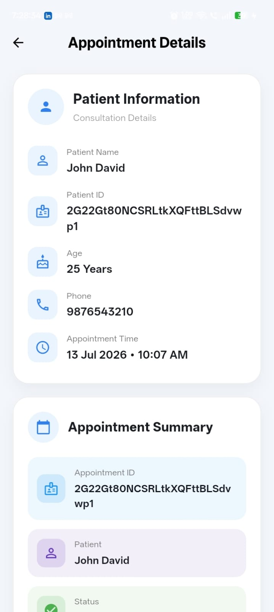
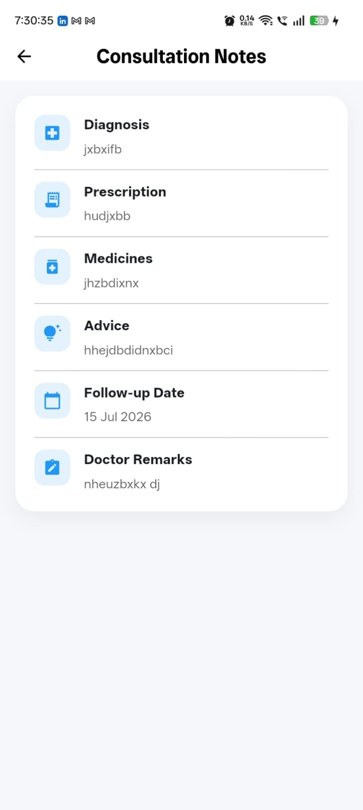

# 🩺 DocConnect - Flutter Telehealth Application

A production-ready Flutter Telehealth application developed as part of a technical assessment. The application allows doctors and patients to securely manage appointments, conduct video consultations, and maintain consultation notes using Firebase and ZegoCloud.

---

# 📱 Features

## 👨‍⚕️ Doctor Module

- Secure Firebase Authentication
- Doctor Dashboard
- View Today's Appointments
- View Appointment Details
- Confirm Appointment
- Cancel Appointment
- Complete Consultation
- Start Video Consultation
- Add Consultation Notes
- View & Edit Consultation Notes
- Logout

---

## 🧑 Patient Module

- Secure Firebase Authentication
- Patient Dashboard
- Book Appointment
- Duplicate Appointment Prevention
- View Upcoming Appointment
- View Appointment History
- Join Video Consultation
- View Consultation Notes
- Logout

---

# 🎥 Video Consultation

This application integrates **ZegoCloud UIKit Prebuilt Call**, a WebRTC-based video calling SDK.


Flutter Package:
< zego_uikit_prebuilt_call >


Features include:

- One-to-one Video Calling
- Local Video Preview
- Remote Video Preview
- Microphone On/Off
- Camera On/Off
- End Call
- Unique Room ID per Appointment

The video call has been tested successfully between **two real Android devices**.

---

# 📝 Consultation Notes

Doctors can record:

- Diagnosis
- Prescription
- Medicines
- Advice
- Follow-up Date
- Doctor Remarks

Patients can securely view the consultation notes after the consultation is completed.

---

# 🔥 Firebase Services

- Firebase Authentication
- Cloud Firestore
- Real-time Appointment Updates

---

# 🛠 Tech Stack

## Frontend

- Flutter
- Dart

## Backend

- Firebase Authentication
- Cloud Firestore

## State Management

- Provider

## Video Calling SDK

- ZegoCloud UIKit Prebuilt Call
- (WebRTC Based)

---

# 📂 Project Structure

```
lib/
│
├── core/
│   ├── constants/
│   ├── theme/
│   └── utils/
│
├── models/
│
├── providers/
│
├── services/
│
├── screens/
│   ├── login/
│   ├── dashboard/
│   ├── patient/
│   ├── notes/
│   ├── video_call/
│   └── appointment/
│
├── widgets/
│
└── main.dart
```

---

# 🚀 How to Run the Project in Android studio or other IDLE's

## 1. Clone Repository

```bash
git clone https://github.com/Rishab-Dani/DoctorTelehealthApp.git
```

---

## 2. Navigate to Project

```bash
cd DocConnect
```

---

## 3. Install Dependencies

```bash
flutter pub get
```

---

## 4. Configure Firebase

Create your Firebase project and add:

- google-services.json (Android)

Enable:

- Firebase Authentication (Email/Password)
- Cloud Firestore

---

## 5. Configure ZegoCloud

Create a free ZegoCloud account.

Replace:

- App ID
- App Sign

with your own credentials.

---

## 6. Run the Project

```bash
flutter run
```

---

# 📱 APK Installation

Download the APK from the Google Drive link below:

**APK Download:**  
`https://drive.google.com/drive/folders/12GfnlW-PwIIdcbmVm0E6tiZIa4cj220j?usp=sharing`

## Installation Steps

1. Download the APK on **two Android devices**.
2. Open the downloaded APK file.
3. If prompted, allow **Install from Unknown Sources**.
4. Tap **Install** and wait for the installation to complete.
5. Repeat the same process on the second Android device.

> **Note:** This application is designed to demonstrate a real-time video consultation between two users. Therefore, two Android devices are required for testing the video call.

---

# 🔐 Demo Login Credentials

## 👨‍⚕️ Doctor Account

**Email:** `doctor@test.com`

**Password:** `Password123`

---

## 🧑 Patient Account

**Email:** `john@test.com`

**Password:** `Password123`

---

# 📞 How to Test the Video Calling Feature

### Device 1 (Doctor)

- Login using the **Doctor** account.

### Device 2 (Patient)

- Login using the **Patient** account.

### Testing Steps

1. Login to the **Patient** account.
2. Book a new appointment.
3. Login to the **Doctor** account on the second device.
4. Open the appointment and tap **Confirm Appointment**.
5. Tap **Start Consultation** to begin the video call.
6. On the Patient device, tap **Join Consultation**.
7. Both users will automatically join the same video consultation room.
8. Verify the following features:

- ✅ Local Video
- ✅ Remote Video
- ✅ Microphone On/Off
- ✅ Camera On/Off
- ✅ End Call

---

# 📋 Application Workflow

## 👨‍⚕️ Doctor Workflow

```
Doctor Login
      │
      ▼
Doctor Dashboard
      │
      ▼
View Appointment
      │
      ▼
Confirm Appointment
      │
      ▼
Start Video Consultation
      │
      ▼
Add Consultation Notes
      │
      ▼
Save Consultation Notes
      │
      ▼
Mark Consultation as Completed
      │
      ▼
Patient Can View Consultation Notes
```

---

## 🧑 Patient Workflow

```
Patient Login
      │
      ▼
Book Appointment
      │
      ▼
Wait for Doctor Confirmation
      │
      ▼
Join Video Consultation
      │
      ▼
View Consultation Notes
```

---

# 📝 Notes

- Firebase Authentication is used for secure login.
- Cloud Firestore is used to store appointments and consultation notes.
- ZegoCloud (WebRTC-based SDK) is used for real-time video calling.
- The video call has been successfully tested between **two real Android devices**.
- Duplicate appointment booking for the same date and time is prevented.

# 🛡 Error Handling

The application handles:

- Invalid Login Credentials
- Firebase Authentication Errors
- Firestore Exceptions
- Duplicate Appointment Booking
- Validation Errors
- Network Failure Messages
- User-friendly SnackBars

---

# 🎨 UI Highlights

- Blue & White Healthcare Theme
- Responsive Design
- Modern Dashboard
- Card-based UI
- Professional Appointment Screens
- Improved Consultation Notes Screen

---

## 📸 Screenshots

### Login



### Doctor Dashboard



### Patient Dashboard



### Book Appointment



### Appointment Details



### Consultation Notes



---


---

# ✅ What is Mocked?

The following items are simplified for this assessment:

- Single doctor workflow
- Demo patient data created through the application
- No push notifications
- No payment integration
- No appointment reminder service

All authentication, appointment management, consultation notes, and video calling are functional.

---

# 🔮 Future Improvements

- Push Notifications
- Appointment Reminder Notifications
- Doctor Availability Calendar
- Search Doctors
- Profile Image Upload
- Medical Reports Upload
- Prescription PDF Generation
- Chat During Consultation
- Appointment Rescheduling
- Dark Mode
- Multi-language Support
- Admin Panel
- Payment Gateway Integration

---

# 📦 APK

Release APK:

Upload the APK to Google Drive and share a public view/download link in your submission.

Example:

```
https://drive.google.com/drive/folders/12GfnlW-PwIIdcbmVm0E6tiZIa4cj220j?usp=sharing
```

---

# 👨‍💻 Developed By

**Rishab R**

Flutter Developer

GitHub:
https://github.com/Rishab-Dani/DoctorTelehealthApp.git

---

# 📄 License

This project was developed for a Flutter technical assessment and learning purposes.